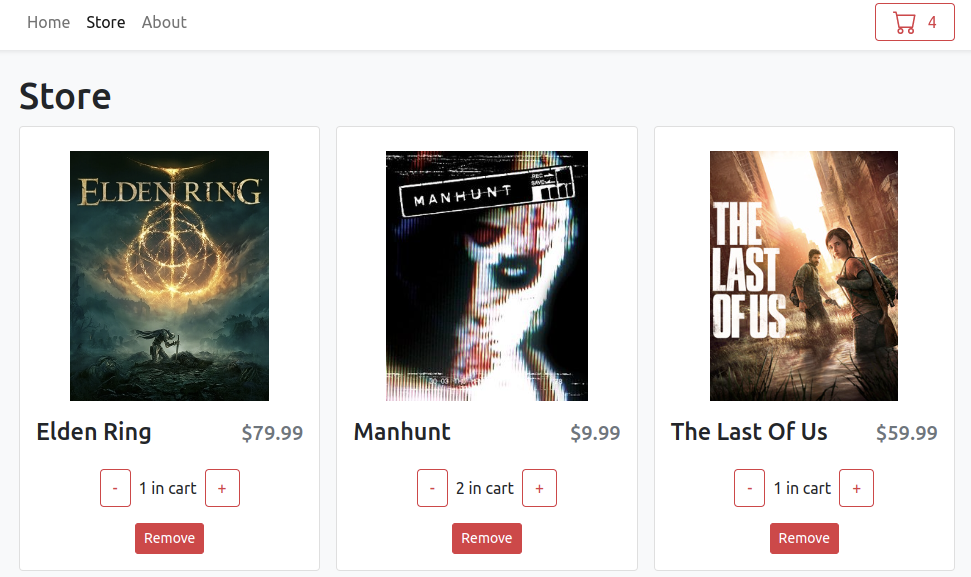

## Game cart app

<br/>



Store and shopping cart functionality made with React, TypeScript and [Vite](https://vitejs.dev/).

### Running the app

To run the app type this command on the terminal:

```bash
$ yarn dev
```

And open http://localhost:3000.

### Production build

To create a production build type on the terminal:

```bash
$ yarn build
```
